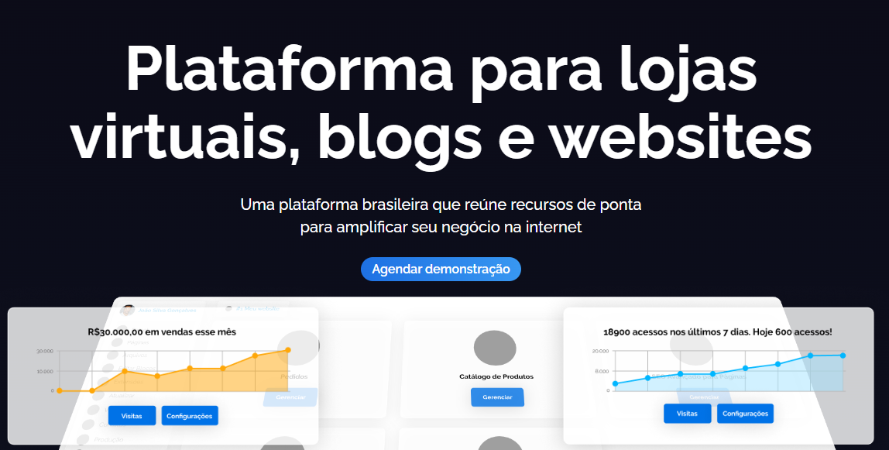

---

# Interago - Página Inicial

Este projeto foi desenvolvido como parte de um processo seletivo, onde a proposta é criar a **página inicial** de uma plataforma chamada **Interago**. A Interago oferece soluções de excelência para a criação de **lojas virtuais**, **portais de notícias** e **sites institucionais**.

## Descrição

A página inicial apresenta o Interago como uma plataforma versátil e moderna, dedicada a atender diferentes tipos de negócios com serviços personalizados. O principal objetivo é destacar a capacidade da Interago em auxiliar empresas a alcançarem sucesso no ambiente digital, através de uma interface intuitiva e focada na experiência do usuário.

## Funcionalidades

- Apresentação clara das categorias de serviços oferecidos: lojas virtuais, portais de notícias e sites institucionais.
- Design moderno e responsivo, compatível com dispositivos móveis e desktop.
- Seções que destacam a excelência do serviço e os benefícios para os clientes.
- CTA (Call to Action) para incentivar o contato com os especialistas da Interago.

## Tecnologias Utilizadas

- **HTML5**: Para a estruturação semântica do conteúdo.
- **CSS3**: Para o design visual, utilizando Flexbox para layout responsivo.
- **Bootstrap 3**: Para garantir um design responsivo e otimizado.
- **jQuery**: Para adicionar interatividade e melhorar a experiência do usuário.

## Agradecimento

Gostaria de agradecer pela oportunidade de participar deste processo seletivo e pela chance de contribuir com este projeto. 
